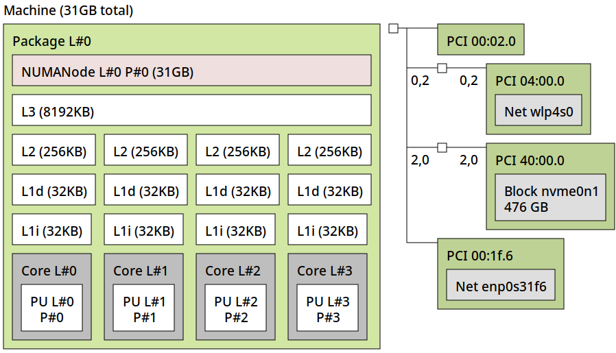

(perf-tune-hwloc)=
# hwloc

> System tuning tools are either about better understanding the system's
> performance, or applying such knowledge to improve it. See our common
> {ref}`system tuning thoughts<explanation-system-tuning-disclaimer>` for
> the general reasons for that.

The default installed package `hwloc-nox` provides various tools to discover the
topology of the chip internal structures as well as any associated devices
like PCI cards, NVME devices and memory.

By default the tools provide command line interfaces, but it can also render
those complex relations in a GUI environment. Depending on which one you want
to use you can install them with `apt install hwloc-nox` or `apt install hwloc`
respectively.

It can be important with a sensitive workload to align the CPU cores
it runs on, to be close to the nodes where the related devices are attached
to the system. That will help to avoid crossing topology boundaries that
add additional latencies. But for that, one needs tools to inspect the
CPU and device topology on the system.

## hwloc-info - hierarchy and details

By default, `hwloc-info` provides a summary of the topology levels that are
present on this system.

Command:

```bash
hwloc-info
```

Output (example on a laptop):

```bash
depth 0:           1 Machine (type #0)
 depth 1:          1 Package (type #1)
  depth 2:         1 L3Cache (type #6)
   depth 3:        4 L2Cache (type #5)
    depth 4:       4 L1dCache (type #4)
     depth 5:      4 L1iCache (type #9)
      depth 6:     4 Core (type #2)
       depth 7:    4 PU (type #3)
Special depth -3:  1 NUMANode (type #13)
Special depth -4:  3 Bridge (type #14)
Special depth -5:  4 PCIDev (type #15)
Special depth -6:  3 OSDev (type #16)
```

But the tool also allows us to get detailed information on any of these
elements. Here is an example to get details on the first core.

Command:

```bash
hwloc-info -p core:0
```

Output:

```bash
Core L#0
 type = Core
 full type = Core
 logical index = 0
 os index = 0
 gp index = 2
 depth = 6
 sibling rank = 0
 children = 1
 memory children = 0
 i/o children = 0
 misc children = 0
 cpuset = 0x00000001
 complete cpuset = 0x00000001
 allowed cpuset = 0x00000001
 nodeset = 0x00000001
 complete nodeset = 0x00000001
 allowed nodeset = 0x00000001
 symmetric subtree = 1
 cpukind = 0
 cpukind efficiency = 0
 cpukind info FrequencyMaxMHz = 4000
 cpukind info FrequencyBaseMHz = 1800
```

See the [`hwloc-info`](https://manpages.ubuntu.com/manpages/noble/man1/hwloc-info.1.html)
man page for a list of all the potential objects that can be queried.

## hwloc-ls - system topology in CLI

If executed without graphical capabilities `hwloc-ls` will provide a text
representation of the CPU, its caches and how they relate to each other
between cores, sockets and hardware in the system.

Command:

```bash
hwloc-ls
```

Output (example on a laptop):

```bash
Machine (31GB total)
  Package L#0
    NUMANode L#0 (P#0 31GB)
    L3 L#0 (8192KB)
      L2 L#0 (256KB) + L1d L#0 (32KB) + L1i L#0 (32KB) + Core L#0 + PU L#0 (P#0)
      L2 L#1 (256KB) + L1d L#1 (32KB) + L1i L#1 (32KB) + Core L#1 + PU L#1 (P#1)
      L2 L#2 (256KB) + L1d L#2 (32KB) + L1i L#2 (32KB) + Core L#2 + PU L#2 (P#2)
      L2 L#3 (256KB) + L1d L#3 (32KB) + L1i L#3 (32KB) + Core L#3 + PU L#3 (P#3)
  HostBridge
    PCI 00:02.0 (VGA)
    PCIBridge
      PCI 04:00.0 (Network)
        Net "wlp4s0"
    PCIBridge
      PCI 40:00.0 (NVMExp)
        Block(Disk) "nvme0n1"
    PCI 00:1f.6 (Ethernet)
      Net "enp0s31f6"
```

Output (example on a server - shortened for readbility):

```bash
Package L#0
    NUMANode L#0 (P#0 378GB)
    L3 L#0 (32MB)
      L2 L#0 (1024KB) + L1d L#0 (48KB) + L1i L#0 (32KB) + Core L#0
        PU L#0 (P#0)
        PU L#1 (P#128)
...
      L2 L#63 (1024KB) + L1d L#63 (48KB) + L1i L#63 (32KB) + Core L#63
        PU L#126 (P#63)
        PU L#127 (P#191)
    HostBridge
      PCIBridge
        PCI 12:00.0 (NVMExp)
          Block(Disk) "nvme1n1"
    HostBridge
      PCIBridge
        PCI 51:00.0 (NVMExp)
          Block(Disk) "nvme0n1"
      PCIBridge
        PCI 52:00.0 (Ethernet)
          Net "enp82s0"
      PCIBridge
        PCIBridge
          PCI 54:00.0 (VGA)
  Package L#1
    NUMANode L#1 (P#1 378GB)
    L3 L#8 (32MB)
      L2 L#64 (1024KB) + L1d L#64 (48KB) + L1i L#64 (32KB) + Core L#64
        PU L#128 (P#64)
        PU L#129 (P#192)
...
      L2 L#127 (1024KB) + L1d L#127 (48KB) + L1i L#127 (32KB) + Core L#127
        PU L#254 (P#127)
        PU L#255 (P#255)
    HostBridge
      PCIBridge
        2 x { PCI f2:00.0-1 (SATA) }
  Misc(MemoryModule)
```

## hwloc-ls - system topology in GUI

Instead of `hwloc-nox` there also is `hwloc` with graphical capabilities which
would render the same in a graphical representation.

Command:

```bash
hwloc-ls
```

Output (CLI shows navigation info, the real content is in the GUI):

```bash
Keyboard shortcuts:
 Zooming, scrolling and closing:
  Zoom-in or out ...................... + -
  Reset scale to default .............. 1
  Try to fit scale to window .......... F
  Resize window to the drawing ........ r
  Toggle auto-resizing of the window .. R
  Scroll vertically ................... Up Down PageUp PageDown
  Scroll horizontally ................. Left Right Ctrl+PageUp/Down
  Scroll to the top-left corner ....... Home
  Scroll to the bottom-right corner ... End
  Refresh the topology ................ F5
  Show this help ...................... h H ?
  Exit ................................ q Q Esc
 Configuration tweaks:
  Toggle factorizing or collapsing .... f
  Switch display mode for indexes ..... i
  Toggle displaying of object text .... t
  Toggle displaying of obj attributes . a
  Toggle displaying of CPU kinds ...... k
  Toggle color for disallowed objects . d
  Toggle color for binding objects .... b
  Toggle displaying of legend lines ... l
  Export to file with current config .. E
```

Output (GUI):



## Further reading

* [`hwloc-ls` man page](https://manpages.ubuntu.com/manpages/noble/en/man1/lstopo.1.html)
* [`hwloc` man page](https://manpages.ubuntu.com/manpages/noble/en/man7/hwloc.7.html)
* [`hwloc-diff` man page](https://manpages.ubuntu.com/manpages/noble/en/man1/hwloc-diff.1.html)
