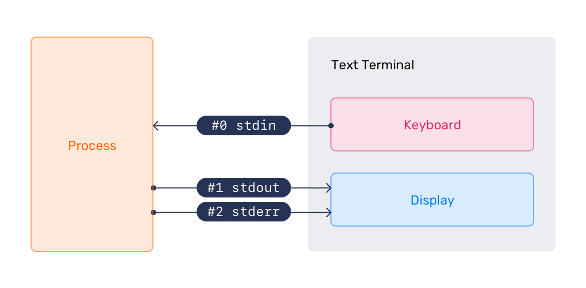

---
myst:
  html_meta:
    description: Tutorial on the Ubuntu terminal. Understand concepts like standard streams, piping, command chaining, and shell variables.
---

(cli-in-depth)=
# The command line in depth

In {ref}`welcome-to-the-terminal`, we learned how to navigate the filesystem, work with files and directories, and manage permissions on the command line. Now we'll go deeper into how to handle data flowing between programs, how to redirect that data to files and other programs, and how **shell variables** and **expansion** make our commands *even more* powerful.

If you are re-using a virtual machine from a different tutorial, skip directly to {ref}`cli-standard-streams`.

% Include the multipass install instructions common to all tutorials
```{include} common-multipass.txt
```


(cli-standard-streams)=
## Standard streams

Now that we can work with files, we're ready to understand something fundamental about how programs work in the terminal: **standard streams**.

Every program that runs has three open communication channels by default:

- **Standard input (stdin)** -- the channel through which the program receives input. By default, this is your keyboard.
- **Standard output (stdout)** -- the channel through which the program sends its results. By default, this is your terminal screen.
- **Standard error (stderr)** -- the channel through which the program sends error messages. This also appears on your terminal screen by default, but it is a separate channel from stdout.



Each stream has a numerical identifier called a **file descriptor**:

- `0` -- stdin
- `1` -- stdout
- `2` -- stderr

You may be wondering: "why three separate channels? Why not just one?".

The answer is that separating normal output from error output gives us much more flexibility. We can save the output of a command to a file while still seeing errors on screen -- or silence errors entirely while saving results. We'll see exactly how in the next sections.


### Redirecting output

Normally, a command's output goes straight to our terminal screen. We can tell the shell to send it somewhere else instead -- like a file.

To redirect output to a file, we use the `>` operator followed by a filename. Let's redirect the output of `ls` to a file called `file-list.txt`:

```{terminal}
:copy:
:user: ubuntu
:host: tutorial
:dir: ~
ls -la > file-list.txt
```

No output appears on screen -- it has all gone into a new file called `file-list.txt` instead.

### Viewing file contents

Now that `file-list.txt` exists and has some content in it, let's look at the commands we can use to see what the file contains. There are a few to choose from, and which one is most convenient depends on how much of the file we want to see.

To print the full contents of a file to the screen, we can use `cat` ("concatenate"):

```{terminal}
:copy:
:user: ubuntu
:host: tutorial
:dir: ~
cat file-list.txt

total 36
drwxr-x--- 4 ubuntu ubuntu 4096 May  1 09:25 .
drwxr-xr-x 3 root   root   4096 Apr 16 14:15 ..
-rw------- 1 ubuntu ubuntu 1623 Apr 23 17:33 .bash_history
-rw-r--r-- 1 ubuntu ubuntu  220 Mar 31  2024 .bash_logout
-rw-r--r-- 1 ubuntu ubuntu 3771 Mar 31  2024 .bashrc
drwx------ 2 ubuntu ubuntu 4096 Apr 16 14:15 .cache
-rw------- 1 ubuntu ubuntu   20 Apr 23 17:33 .lesshst
-rw-r--r-- 1 ubuntu ubuntu  807 Mar 31  2024 .profile
drwx------ 2 ubuntu ubuntu 4096 Apr 16 14:15 .ssh
-rw-r--r-- 1 ubuntu ubuntu    0 Apr 23 11:05 .sudo_as_admin_successful
-rw-rw-r-- 1 ubuntu ubuntu    0 May  1 09:25 file-list.txt
```

You may see more lines or fewer lines here, depending on whether you ran through the {ref}`welcome-to-the-terminal` tutorial with this VM or not.

For longer files, `less` is more comfortable -- with `less` we can scroll through the outputs one page at a time. Let's look at `/etc/passwd`, which stores user account information and is long enough to scroll through:

```{terminal}
:copy:
:user: ubuntu
:host: tutorial
:dir: ~
less /etc/passwd
```

Press {kbd}`Space` to move down a page, and {kbd}`Q` to quit when you are done.

If we only want to see the first lines of a file, we can use `head`:

```{terminal}
:copy:
:user: ubuntu
:host: tutorial
:dir: ~
head /etc/passwd

root:x:0:0:root:/root:/bin/bash
daemon:x:1:1:daemon:/usr/sbin:/usr/sbin/nologin
bin:x:2:2:bin:/bin:/usr/sbin/nologin
sys:x:3:3:sys:/dev:/usr/sbin/nologin
sync:x:4:65534:sync:/bin:/bin/sync
games:x:5:60:games:/usr/games:/usr/sbin/nologin
man:x:6:12:man:/var/cache/man:/usr/sbin/nologin
lp:x:7:7:lp:/var/spool/lpd:/usr/sbin/nologin
mail:x:8:8:mail:/var/spool/mail:/usr/sbin/nologin
news:x:9:9:news:/var/spool/news:/usr/sbin/nologin
```

By default, `head` shows the first 10 lines but we can request a different number using the `-n` flag. For example, `head -n 5 /etc/passwd` shows only the first 5 lines.

Or we can see the last few lines with `tail`, which is used the same way as `head`:

```{terminal}
:copy:
:user: ubuntu
:host: tutorial
:dir: ~
tail -n 3 /etc/passwd

fwupd-refresh:x:990:990:Firmware update daemon:/var/lib/fwupd:/usr/sbin/nologin
polkitd:x:989:989:User for polkitd:/:/usr/sbin/nologin
ubuntu:x:1000:1000:Ubuntu:/home/ubuntu:/bin/bash
```

`tail` is especially useful for examining log files, where the most recent entries are always at the bottom.

:::{warning}
One thing to be careful about: we know that `file-list.txt` is empty because didn't exist before, but if `file-list.txt` had already contained something, `>` would have overwritten it completely. To *add* things to the end of an existing file rather than replacing it, we use `>>` (**append** mode):
:::

Let's make our file a bit longer by using `>>` to add extra contents:

```{terminal}
:copy:
:user: ubuntu
:host: tutorial
:dir: ~
ls -l /tmp >> file-list.txt
```

Now `file-list.txt` contains the original home directory listing followed by the `/tmp` listing. We can check on this by using `cat file-list.txt` again.

Sometimes we want a command to run **silently**, i.e. with its output discarded entirely. We can redirect stdout to `/dev/null`, a special file that throws away everything written to it:

```{terminal}
:copy:
:user: ubuntu
:host: tutorial
:dir: ~
ping -c 2 localhost > /dev/null
```

We can also redirect stderr (file descriptor `2`) independently from stdout. This is useful for capturing errors to a log file while still seeing normal output on screen:

```{terminal}
:copy:
:user: ubuntu
:host: tutorial
:dir: ~
ls /nonexistent 2> errors.txt
```

Checking on this file shows us the error that would otherwise have been printed to the screen:

```{terminal}
:copy:
:user: ubuntu
:host: tutorial
:dir: ~
cat errors.txt

ls: cannot access '/nonexistent': No such file or directory
```

We can also merge stderr into stdout using `2>&1`, which means "send file descriptor 2 to wherever file descriptor 1 is currently going":

```{terminal}
:copy:
:user: ubuntu
:host: tutorial
:dir: ~
ls /nonexistent >> output.txt 2>&1
```

By doing this, both normal output and error messages will now appear in `output.txt`.


### Redirecting input

We can go the other direction too! Instead of a command reading from the keyboard, we can feed it input from a file using the `<` operator.

Let's use `wc` ("word count"), which counts lines, words, and characters in its input. Without redirection, we would type text and press {kbd}`Ctrl` + {kbd}`D` to signal the end of input. Instead, we can feed it a file directly:

```{terminal}
:copy:
:user: ubuntu
:host: tutorial
:dir: ~
wc -l < /etc/passwd

33
```

Once again, you might see a different value here, depending on whether this is a new VM or you're reusing the one from the previous tutorial.

The `-l` flag tells `wc` to count lines only. When we use `<`, the file name does not appear in the output -- `wc` sees the file's contents as if they had been typed at the keyboard.

### Here-documents

There is a related form called a **here-document**, written as `<<`. It lets us type multi-line input directly in the terminal, ending when we type a delimiter we choose ourselves (often `EOF` is used as this marker -- short for "end of file"). Let's test this by sending a greeting into a new file called `greeting.txt`:

```{terminal}
:copy:
:user: ubuntu
:host: tutorial
:dir: ~
cat > greeting.txt << EOF
```
```{terminal}
:copy:
:user: ubuntu
:host: tutorial
:dir: ~
Hello from the terminal!
```
```{terminal}
:copy:
:user: ubuntu
:host: tutorial
:dir: ~
This text is going into a file.
```
```{terminal}
:copy:
:user: ubuntu
:host: tutorial
:dir: ~
EOF
```

The shell reads everything we type until it sees `EOF` on a line by itself, then passes it all as input to the command on the left. Let's confirm the file was created correctly:

```{terminal}
:copy:
:user: ubuntu
:host: tutorial
:dir: ~
cat greeting.txt

Hello from the terminal!
This text is going into a file.
```


## Pipes

Pipes are one of the most powerful ideas in the Unix philosophy: the output of one command becomes the input of the next. We connect them with the `|` operator (the "pipe" character).

For example, `ls -la /usr/bin` produces many lines of output -- more than can fit on screen, and you can only see the end of the output. Scrolling back up is often very inconvenient, if you can even do it at all (some terminals can't!). To make it more convenient, we can pipe the output to `less` so we can page through it with the {kbd}`space` key:

```{terminal}
:copy:
:user: ubuntu
:host: tutorial
:dir: ~
ls -la /usr/bin | less
```

Press {kbd}`Q` to quit `less` when you are done.

We can also pipe to `grep` to filter the output, keeping only lines that match a pattern. Let's find all currently set environment variables whose names contain the word `LANG`:

```{terminal}
:copy:
:user: ubuntu
:host: tutorial
:dir: ~
env | grep LANG

LANG=C.UTF-8
```

Pipes can be chained together to build a **pipeline** -- each command passes its output along to the next. For example, to see the 3 most recently modified files in `/usr/bin`, we can sort by modification time and then cut the output down with `head`:

```{terminal}
:copy:
:user: ubuntu
:host: tutorial
:dir: ~
ls -lt /usr/bin | head -n 3

total 121540
-rwxr-xr-x 1 root root      174328 Apr 30 13:32 kmod
lrwxrwxrwx 1 root root           4 Apr 30 13:32 lsmod -> kmod
```

Each command in the pipeline only ever sees the output of the command immediately before it -- the shell connects them all behind the scenes.


## Chaining commands

Pipes pass data from one command to another and run all of their commands in parallel. This allows commands to begin working on long streams of data while their source is still producing more. However, there are scenarios where you might want a serial process, in which case you would use **command chaining** instead. Chaining is different: it controls the *order* in which commands run, and whether the next command runs at all.

The simplest way to chain commands is to separate them with a semicolon (`;`). The shell runs each command in turn, regardless of whether the previous one succeeded, with the output of each command shown on separate lines:

```{terminal}
:copy:
:user: ubuntu
:host: tutorial
:dir: ~
ls; pwd; whoami

errors.txt  file-list.txt  greeting.txt  output.txt
/home/ubuntu
ubuntu
```

```{note}
On Linux, processes declare whether they have "succeeded" or not with an **exit code**. An exit code (or "exit status") is a number from 0--255 that a process gives to its parent upon completion. "Success" is defined by exiting with code `0`, with *all* other values indicating different types of failures. These might be specific to a particular program, but the generic failure status will usually be exit code `1`. You can use `exit n` to immediately exit with code `n`.
```

Often we want the second command to run *only* if the first one succeeded. We use `&&` for this:

```{terminal}
:copy:
:user: ubuntu
:host: tutorial
:dir: ~
cd /tmp && ls

snap-private-tmp  systemd-private-[...]
```

If `cd /tmp` had failed (which can happen in a script when the directory does not exist), `ls` would not run at all.

The opposite of `&&` is `||`, which runs the second command only if the first one *failed*:

```{terminal}
:copy:
:user: ubuntu
:host: tutorial
:dir: ~/tmp
cd /nonexistent || echo "Could not change directory"

-bash: cd: /nonexistent: No such file or directory
Could not change directory
```

We can combine `&&` and `||` to produce a simple success-or-failure message:

```{terminal}
:copy:
:user: ubuntu
:host: tutorial
:dir: ~/tmp
ping -c1 localhost && echo "Host is up" || echo "Host is unreachable"

PING localhost (::1) 56 data bytes
[...]
Host is up
```

A few other operators are useful to know. Try each of these out, both with and without the operators, to see how they change the behaviour for yourself:

Background execution; `&`
: Runs a command in the background. The shell prompt returns immediately, and the command continues running. Let's compare the difference in running `sleep 10` and then `sleep 10 &`. The `sleep` command doesn't actually *do* anything, it just makes the system wait for the specified number of seconds. So, in this example our prompt disappears for 10 seconds and you can't interact with the terminal during that time. If we *background* it, using `sleep 10 &`, our command prompt returns immediately and we can continue to use the terminal.
: When we use the ampersand (`&`) to background the process, it returns something like:
  ```text
  [1] 168658
  ```
  This number is the **process ID** (PID); a unique number identifying every process running on your machine. When the background process has finished running, you'll see a message returned that looks like this, so you know it's done:
  ```text
  [1]+  Done                    sleep 10
  ```

Command grouping; `{}`
: Groups commands together so they share the same output redirection or run as a unit. E.g. to create a quick log file you could run:
: ```text
  { echo "System Report"; date; uptime; } > report.txt
  ```

Subshell execution; `()`
: Run commands in a subshell, where the commands are forgotten the moment they finish running. This is useful for isolating side effects like a `cd` -- the directory change does not affect the current shell.
: ```text
  (export NAME="Alice"; echo "Hello $NAME")
  echo "Name is: $NAME"
  ```

Line continuation; `\`
: Continue a long command on the next line, which helps a lot with command readability. You'll see this often in documentation.

Let's return home before continuing:

```{terminal}
:copy:
:user: ubuntu
:host: tutorial
:dir: /tmp
cd ~
```

## Shell environment variables

Before we look at shell expansion, we need to understand **shell variables**, because expansion builds heavily on them.

Think of a variable as a labelled box: we give it a name, put a value inside, and later retrieve that value using the name of the box. The shell uses variables to store all kinds of information -- including a great deal about the environment we're working in.

### Built-in variables

The shell already has a number of variables set up for us. To see every variable currently set in our environment, we can run:

```{terminal}
:copy:
:user: ubuntu
:host: tutorial
:dir: ~
env
```

We can print the value of any variable using `echo` with a `$` in front of the variable name:

```{terminal}
:copy:
:user: ubuntu
:host: tutorial
:dir: ~
echo $SHELL

/bin/bash
```

```{terminal}
:copy:
:user: ubuntu
:host: tutorial
:dir: ~
echo $USER

ubuntu
```

```{terminal}
:copy:
:user: ubuntu
:host: tutorial
:dir: ~
echo $HOME

/home/ubuntu
```

One particularly important variable is `PATH`. It tells the shell which directories to search when we type a command name:

```{terminal}
:copy:
:user: ubuntu
:host: tutorial
:dir: ~
echo $PATH

/usr/local/sbin:/usr/local/bin:/usr/sbin:/usr/bin:/sbin:/bin:/usr/games:/usr/local/games:/snap/bin
```

Each directory is separated by a colon (`:`). When we type a command like `ls`, the shell searches through each of these directories in order until it finds a program with that name. This is why we can run commands without typing their full path. If a command lives outside these directories, we have to give its full path explicitly.

### Setting and unsetting variables

We can create our own variables by assigning a name and a value. By convention, user-defined variable names are uppercase:

```{terminal}
:copy:
:user: ubuntu
:host: tutorial
:dir: ~
GREETING="Hello, world!"
```
```{terminal}
:copy:
:user: ubuntu
:host: tutorial
:dir: ~
echo $GREETING

Hello, world!
```

To remove a variable, we use `unset`:

```{terminal}
:copy:
:user: ubuntu
:host: tutorial
:dir: ~
unset GREETING
```
```{terminal}
:copy:
:user: ubuntu
:host: tutorial
:dir: ~
echo $GREETING

```

This time we get no output, because the variable no longer exists.

### Exporting variables to subshells

Variables we create in the shell are only available in the current shell session. If a new shell process is started (for example, when running a script), it will not have access to our variables unless we **export** them.

Let's demonstrate. First, we set a variable and try to access it from a subshell:

```{terminal}
:copy:
:user: ubuntu
:host: tutorial
:dir: ~
MY_VAR="hello"
```
```{terminal}
:copy:
:user: ubuntu
:host: tutorial
:dir: ~
bash -c 'echo $MY_VAR'

```

Nothing is printed -- the subshell has no knowledge of `MY_VAR`. Now let's export it first:

```{terminal}
:copy:
:user: ubuntu
:host: tutorial
:dir: ~
export MY_VAR="hello"
```
```{terminal}
:copy:
:user: ubuntu
:host: tutorial
:dir: ~
bash -c 'echo $MY_VAR'

hello
```

`export` makes the variable part of the environment that is passed down to any child processes we start.

### Special read-only variables

Some variables are set by the shell itself and can only be read, never assigned. Two of the most useful are:

- `$?` -- the exit status of the last command. `0` means success; any non-zero value means something went wrong.
- `$$` -- the Process ID (PID) of the current shell.

Let's see `$?` in action. A successful command returns `0`:

```{terminal}
:copy:
:user: ubuntu
:host: tutorial
:dir: ~
ls /etc/passwd

/etc/passwd
```

```{terminal}
:copy:
:user: ubuntu
:host: tutorial
:dir: ~
echo $?

0
```

And a failing command returns a non-zero value:

```{terminal}
:copy:
:user: ubuntu
:host: tutorial
:dir: ~
ls /nonexistent

ls: cannot access '/nonexistent': No such file or directory
```

```{terminal}
:copy:
:user: ubuntu
:host: tutorial
:dir: ~
echo $?

2
```

This is especially useful when we build scripts, where we can check whether the previous command succeeded before deciding what to do next.

## Shell expansion

When we press {kbd}`Enter` on a command, the shell does not send our text directly to the program. First, it processes the command line and **expands** certain patterns into their final values. Understanding expansion explains a lot of seemingly "magic" shell behaviour.

### Tilde expansion

We have already used tilde expansion without thinking about it. When the shell sees `~` at the start of a word, it replaces it with the value of `$HOME`:

```{terminal}
:copy:
:user: ubuntu
:host: tutorial
:dir: ~
echo ~

/home/ubuntu
```

```{terminal}
:copy:
:user: ubuntu
:host: tutorial
:dir: ~
echo ~/my-file.txt

/home/ubuntu/my-file.txt
```

### Variable expansion

We have seen this already: `$VARIABLE_NAME` (or `${VARIABLE_NAME}`) is replaced with the variable's value before the command runs. The braces form is important when the variable name might be confused with the characters that follow it:

```{terminal}
:copy:
:user: ubuntu
:host: tutorial
:dir: ~
DAY="Monday"
```
```{terminal}
:copy:
:user: ubuntu
:host: tutorial
:dir: ~
echo "Today is ${DAY}!"

Today is Monday!
```

Without the braces, the shell would try to expand `$DAY!` as a single variable name and find nothing.

It's also important to note that this variable expansion applies *everywhere* in the line, even with the command name itself!:

```{terminal}
:copy:
:user: ubuntu
:host: tutorial
:dir: ~
CMD="echo"
```
```{terminal}
:copy:
:user: ubuntu
:host: tutorial
:dir: ~
$CMD "It's dynamic!"

It's dynamic!
```

This can be useful in, say, a script that runs one of two very similar commands with the same argument, so you don't have to re-type everything twice in your conditional.


### Command substitution

Command substitution lets us use the *output of a command* as part of another command. We wrap the inner command in `$(...)`:

```{terminal}
:copy:
:user: ubuntu
:host: tutorial
:dir: ~
echo "Today is $(date)"

Today is Fri Apr 24 10:00:00 BST 2026
```

The shell runs `date` first, captures its output, and substitutes it into the outer command before running it.

### Arithmetic expansion

For integer arithmetic, we use `$((...))`:

```{terminal}
:copy:
:user: ubuntu
:host: tutorial
:dir: ~
echo $((5 + 3))

8
```

```{terminal}
:copy:
:user: ubuntu
:host: tutorial
:dir: ~
X=10
```
```{terminal}
:copy:
:user: ubuntu
:host: tutorial
:dir: ~
echo $((X * 2))

20
```

The available Arithmetic operators are:

* Addition (`+`)
* Subtraction (`-`)
* Multiplication (`*`)
* Integer division (`/`)
* Modulo/remainder (`%`)
* Exponentiation (`**`)


### Brace expansion

Brace expansion generates a list of strings from a pattern. Unlike the other types of expansion, it does not involve variables or filenames -- it is a purely text-based generation mechanism:

```{terminal}
:copy:
:user: ubuntu
:host: tutorial
:dir: ~
echo sp{in,an,ar}

spin span spar
```

Ranges work too, using `..`:

```{terminal}
:copy:
:user: ubuntu
:host: tutorial
:dir: ~
echo {1..10}

1 2 3 4 5 6 7 8 9 10
```

Brace expansion is particularly useful for creating multiple files or directories in one command. For example, to create a directory for each month of the year:

```{terminal}
:copy:
:user: ubuntu
:host: tutorial
:dir: ~
mkdir {01..12}-reports
```
```{terminal}
:copy:
:user: ubuntu
:host: tutorial
:dir: ~
ls

01-reports  02-reports  03-reports  04-reports  05-reports  06-reports
07-reports  08-reports  09-reports  10-reports  11-reports  12-reports
```

We can even clean them up in one command, too:

```{terminal}
:copy:
:user: ubuntu
:host: tutorial
:dir: ~
rm -r {01..12}-reports
```

### Wildcard expansion

Wildcard expansion (also called **globbing**) lets us match filenames by pattern. We touched on this in {ref}`welcome-to-the-terminal` when we used `mv *.txt my-folder` to move all text files at once.

The three main wildcards are:

`*`
: Matches any sequence of characters (including none), so as we saw previously, `*.txt` matches all files ending in `.txt`.

`?`
: Matches any single character. For example, `file?.txt` matches `file1.txt` and `fileA.txt`, but not `file10.txt`.

`[...]`
: Matches any one of the characters inside the brackets. `file[123].txt` matches `file1.txt`, `file2.txt`, and `file3.txt` only.

Character classes like `[[:digit:]]` and `[[:alpha:]]` can be used inside brackets to match whole categories of characters.

Let's see wildcards in action. To list every file in `/usr/bin` whose name starts with `m`:

```{terminal}
:copy:
:user: ubuntu
:host: tutorial
:dir: ~
ls /usr/bin/m*

/usr/bin/make  /usr/bin/man  /usr/bin/md5sum  [...]
```

Wildcards are expanded by the shell *before* the command runs, so the program receives the resulting list of matching filenames -- it never sees the `*` character itself.

## Success!

This is the end of our journey around the terminal, and some of the powerful things we can do with it, but it's certainly not all there is to know!

If you wish, you can continue to explore the file system on your virtual machine.

Once you are finished and want to exit the VM, just type "`exit`".

```{terminal}
:copy:
:user: ubuntu
:host: tutorial
:dir: ~
exit
```

This will take you out of the VM and back to your live machine. Then, you can run the following commands to delete the VM and remove it completely from your machine:

```{terminal}
:copy:
:user: ubuntu
:host: tutorial
:dir: ~
multipass delete tutorial
multipass purge
```


## Next steps

If you wish to continue learning, we recommend following the {ref}`managing-software` tutorial next. This tutorial will teach you all the different ways to handle installing, removing and customizing software on your Ubuntu machine, as well as how to safely keep it up-to-date.