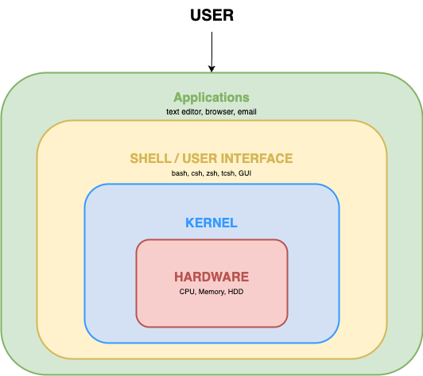

(welcome-to-the-terminal)=
# Welcome to the terminal

On Ubuntu Server, the terminal is the primary way of interacting with your system.
It's easier to use than you might think, and learning it gives you much more control over your system (including on your Ubuntu Desktop).

In this tutorial, we'll use a virtual machine (VM) with Ubuntu Server to poke around and explore the terminal in a safe sandbox that won't affect your computer. You'll learn how to navigate your system, how to find and work with files, and where to find help if you get stuck.


## Prerequisites

* **Knowledge:**

  None! You don't even need to use an Ubuntu machine -- we will use Multipass to create a virtual Ubuntu environment to play with.

* **Hardware:**

  The Multipass virtual machine needs at least **5 GB of disk space**, and **1 GB of memory**.


## Install Multipass

::::{tab-set}

:::{tab-item} On Ubuntu
You can install Multipass directly from [the Multipass page](https://snapcraft.io/multipass) in the online snap store (make sure to select the "latest/stable" version from the dropdown menu next to the install button).
:::

:::{tab-item} On other operating systems

If you're on Windows, Mac, or another Linux operating system, Multipass can be installed [using these instructions](https://documentation.ubuntu.com/multipass/stable/how-to-guides/install-multipass/).
:::

::::

## Open a terminal window

Now that Multipass is installed, we need a terminal window to run our commands in. How you open one depends on your operating system.

::::{tab-set}

:::{tab-item} On Ubuntu
Press {kbd}`Ctrl` + {kbd}`Alt` + {kbd}`T` together and a terminal window will open. You can also search for "Terminal" in your application launcher.
:::

:::{tab-item} On Windows
PowerShell is the most reliable option for working with Multipass on Windows.

1. Press the {kbd}`Windows` key.
1. Type `PowerShell`.
1. Right-click it and select **Run as Administrator** — this helps avoid permission issues when managing virtual machines.

If you have Windows Terminal installed from the Microsoft Store, that works just as well and offers a nicer experience with tab support.

To confirm everything is working, type `multipass version` and press {kbd}`Enter`. If you see version numbers, you're ready to continue.
:::

:::{tab-item} On macOS
1. Press {kbd}`⌘` + {kbd}`Space` to open Spotlight.
1. Type `Terminal` and press {kbd}`Enter`.

If you use iTerm2, that works perfectly well too.

To confirm everything is working, type `multipass version` and press {kbd}`Enter`. If you see version numbers, you're ready to continue.
:::

::::

In our new terminal window, we see a **shell prompt** (sometimes called a command prompt), which is constructed as `your-user-name@your-machine-name` and followed by a dollar sign (`$`). This is where we input commands to the computer.

```{terminal}
Input: The commands you type

Output: The results after running the command
```

The output -- the results of running your commands -- is shown separately, underneath the shell prompt.

```{tip}
You can use your mouse to copy text *into* the terminal by holding the *left mouse button* and dragging your mouse to highlight the text you want to copy. Then, release the left button.

Move your mouse pointer to the terminal window and press the *middle mouse button* (or click the *right mouse button* and select {guilabel}`paste`).
```

The **Command Line Interface (CLI)** is the language we use in our terminal to interact with our system. The CLI gives you far more control over your system than the **Graphical User Interface (GUI)** that you may be more familiar with.

In software documentation, you will often see instructions to "run" or "execute" a command (or a set of commands). What this means is: type the command into your terminal at the **shell prompt** and press {kbd}`Enter` on your keyboard. Let's try that out, and launch a new Multipass VM called "tutorial" with the following command:

```{terminal}
:copy:
:user: user
:host: computer
:dir: ~
multipass launch --name tutorial
```

The command is sent to the **shell**, which interprets the command and sends it to the operating system, which runs the command. It takes a little time for the `tutorial` instance to be created, but eventually the shell shows output like this:

```{terminal}
:copy:
:user: user
:host: computer
:dir: ~
multipass launch --name tutorial

Launched: tutorial
```

We've just successfully run our first command on the CLI!


### The shell

You may be wondering: "why we need a shell at all? Why can't we just tell the operating system what to do directly?"

This is a good question. In short, it's because the hardware in our machines doesn't speak "human", and it's difficult and time consuming for us to try and speak "computer". So, we use the shell as a translation layer to convert what we want into precise **system calls** that the computer can understand. 



This makes computers much easier to work with, and it means we don't need to be fluent in binary code. Instead, we can learn commands, which are a sort of shorthand.

In fact, Multipass *itself* is a shell. Instead of being a translation layer around our physical machine, it's a translation layer around the *virtual* machine we've just made. Let's access our virtual machine now by running this command:

```{terminal}
:copy:
:user: user
:host: computer
:dir: ~
multipass shell tutorial
```

After we run the command, our terminal window should show us a welcome message like this:

```{terminal}
:copy:
:user: ubuntu
:host: tutorial
:dir: ~
multipass shell tutorial

Welcome to Ubuntu 24.04.4 LTS (GNU/Linux 6.8.0-106-generic x86_64)

 * Documentation:  https://help.ubuntu.com
 * Management:     https://landscape.canonical.com
 * Support:        https://ubuntu.com/pro

 System information as of Thu Apr 16 14:25:25 BST 2026

  System load:  0.09              Processes:             99
  Usage of /:   49.7% of 3.80GB   Users logged in:       0
  Memory usage: 20%               IPv4 address for ens3: 10.234.118.216
  Swap usage:   0%


Expanded Security Maintenance for Applications is not enabled.

51 updates can be applied immediately.
42 of these updates are standard security updates.
To see these additional updates run: apt list --upgradable

Enable ESM Apps to receive additional future security updates.
See https://ubuntu.com/esm or run: sudo pro status


To run a command as administrator (user "root"), use "sudo <command>".
See "man sudo_root" for details.
```

You've probably noticed that your shell prompt has changed, and now says `ubuntu@tutorial:~$` -- `tutorial` is the name of our virtual machine, and `ubuntu` is the default username in a Multipass virtual machine. This is how we know we're now playing in our virtual sandbox, and not in our physical computer.


### Other ways to use commands

As we've now seen, commands are the instructions that we give the computer by typing them into the terminal. In our documentation, commands are `formatted like this`.

Sometimes, we might want to run a whole set of commands at once.
For convenience, we can save them in a file called a **shell script**, in the order we want the computer to run them. Then, we just need to command the computer to run the script, and it runs the commands in the script by itself.

As you become more familiar with the command line, you can also begin to define your own commands built from other commands. These are called **aliases**, and they can be very handy shortcuts for small sets of commands you want to run often.


## Navigating the filesystem

The **filesystem** is the structure your operating system uses to organize all files and directories on the computer. It's like the folder structure you see on a desktop computer's file manager, except we'll be navigating it using text commands in the CLI.

There are some CLI commands that are so useful, and that we'll use so often, they'll become baked into our memory. First, let's try this one:

```{terminal}
:copy:
:user: ubuntu
:host: tutorial
:dir: ~
ls
```

Nothing happened, right?

The `ls` command ("list show") shows us a list of all the files in our current folder. This is a brand new virtual machine, though, and we haven't created anything yet, so there's nothing to show! Let's fix that by creating a few files using the `touch` command:

```{terminal}
:copy:
:user: ubuntu
:host: tutorial
:dir: ~
touch my-first-file.txt my-second-file.txt my-third-file.txt
```

Now if we run `ls` again it should show them to us:

```{terminal}
:copy:
:user: ubuntu
:host: tutorial
:dir: ~
ls

my-first-file.txt my-second-file.txt my-third-file.txt
```

We can also create folders to help keep all our files organized using the `mkdir` command:

```{terminal}
:copy:
:user: ubuntu
:host: tutorial
:dir: ~
mkdir my-folder
```

Let's run `ls` again:

```{terminal}
:copy:
:user: ubuntu
:host: tutorial
:dir: ~
ls

my-first-file.txt my-folder my-second-file.txt my-third-file.txt
```

There is our new folder!

The `mkdir` command is short for "make directory". A directory is exactly the same as a folder, but it abbreviates to the conveniently short `dir` so it's used more often. We'll use them interchangeably.

Let's now move the three files we created into `my-folder`, so we can keep our current folder nice and tidy. We can do this using the `mv` command.

Since it doesn't know which files to move, we must give some **arguments** to the move (`mv`) command. Actually, we already did this with our `touch` and `mkdir` commands earlier:

```bash
touch FILE(S)
touch <file-name> # Create one file
touch <file-name-1> <file-name-2> # Create more than one file

mkdir FOLDER(S)
mkdir <folder-name> # To create one folder
mkdir <folder-name-1> <folder-name-2> # To create more than one folder
```

The `mv` command is similar, but takes more arguments:

```bash
mv FILE(S) FOLDER
mv <file-name> <folder-name> # Move specific file to this folder
mv <file-name-1> <file-name-2> <folder-name> # Move all the named files to this folder
```

You can move any number of files you want. The names of the files you want to move always come right after the `mv` command. The folder you want to move those files to is *always* at the end. That's to say, these are **positional arguments** -- the order of where they appear in the command is important.

If you have a lot of files to move, though, there's a handy shortcut.

```{terminal}
:copy:
:user: ubuntu
:host: tutorial
:dir: ~
mv *.txt my-folder
``` 

The wildcard (`*`) symbol tells the `mv` command to look for *all files* whose name matches the pattern. In this case, files with *any* name, but ending with the `.txt` file extension. Let's check this did what we expected:

```{terminal}
:copy:
:user: ubuntu
:host: tutorial
:dir: ~
ls

my-folder
```

Nice and tidy! But how do we know that the files have been moved, and not just deleted?

Here, we can use the `cd` command ("change directory"), to move to `my-folder` and take a peek inside:

```{terminal}
:copy:
:user: ubuntu
:host: tutorial
:dir: ~
cd my-folder/
```
```{terminal}
:copy:
:user: ubuntu
:host: tutorial
:dir: ~/my-folder
ls

my-first-file.txt my-second-file.txt my-third-file.txt
```

Did you notice how the shell prompt changed to `ubuntu@tutorial:~/my-folder$` after we used the `cd` command? This is our biggest navigation help! The tilde (`~`) symbol signifies our home directory, which was our starting point. This is often called the "root directory". All the directories and subdirectories we create can trace a path back to the root directory.

Let's illustrate how this works by moving around a bit more. Start by making a subdirectory:

```{terminal}
:copy:
:user: ubuntu
:host: tutorial
:dir: ~/my-folder
mkdir second-level
```

Another helpful feature of the command line is "tab completion". If a command, directory, or file already exists, we can start typing it and then press the {kbd}`TAB` key on the keyboard to complete it. Let's navigate to the directory we just made by typing `cd s`, and then press {kbd}`TAB`. The CLI automatically fills in the rest!


```{terminal}
:copy:
:user: ubuntu
:host: tutorial
:dir: ~/my-folder
cd second-level/
```

And then let's make another subdirectory, and change to it:

```{terminal}
:copy:
:user: ubuntu
:host: tutorial
:dir: ~/my-folder/second-level
mkdir third-level
```
```{terminal}
:copy:
:user: ubuntu
:host: tutorial
:dir: ~/my-folder/second-level
cd third-level
```

We're getting quite far into the subdirectory structure now. Let's use the `pwd` command to double check exactly where we are:

```{terminal}
:copy:
:user: ubuntu
:host: tutorial
:dir: ~/my-folder/second-level/third-level
pwd

/home/ubuntu/my-folder/second-level/third-level
```

This command shows us our "present working directory" (sometimes people refer to it as the "current working directory"), and shows us the path we took to get to where currently are!

So, now we're here, how do we get back again?

You guessed it -- with our `cd` command:

```{terminal}
:copy:
:user: ubuntu
:host: tutorial
:dir: ~/my-folder/second-level/third-level
cd ..
```

Using `cd ..` will take us back up one directory -- in our case, from `third-level` back to the `second-level`. The `..` dots represent one folder level, and we could go back any number of levels we like using forward slashes (`/`) as separators between the dots. For example, starting from `third-level`, using `cd ../..` would take us back two levels, to `my-folder`, and `cd ../../..` takes us back three levels, to our home directory.

If we know we want to go back to the home directory, though, we could could also use `cd ~` to skip back there directly.

```{terminal}
:copy:
:user: ubuntu
:host: tutorial
:dir: ~/my-folder/second-level
cd ~
```
```{terminal}
:copy:
:user: ubuntu
:host: tutorial
:dir: ~
pwd

/home/ubuntu
```

And now we're back home again!

To keep things tidy, let's remove the directories we created using the `rmdir` ("remove directory") command:

```{terminal}
:copy:
:user: ubuntu
:host: tutorial
:dir: ~
rmdir my-folder
```

But wait! This returns an error message: `rmdir: failed to remove 'my-folder/': Directory not empty`.
It turns out that `rmdir` is a safe option, because it will *only* let you delete a directory if it is empty. This prevents you from accidentally deleting files you didn't know were in the folder.

One option we have is to go back to our `second-level` directory, and from there, run `rmdir third-level`. Then, change to the `my-folder` directory and delete the `second-level` directory using `rmdir second-level`. Then, finally, we can return home and run the `rmdir my-folder` command again, and it will work.

A faster (but less safe) option, is to use `rm` ("remove") instead.

Since we're in a sandbox, and we know there's nothing in this entire tree of folders we want to save, we can go ahead. Here, we're going to use the `-r` flag to *recursively* delete the `my-folder` dir, and all its subdirectories.

```{terminal}
:copy:
:user: ubuntu
:host: tutorial
:dir: ~
rm -r my-folder
```

Now if we run `ls` again, we'll see nothing gets returned, because our home directory is empty once more!

The `rm` command won't let you delete a directory without the `-r` flag, but it also won't stop you (or ask if you're *really, truly* sure) when deleting a folder and all its contents -- so you should be cautious when using this command on a real system, to ensure you're really sure you're not going to delete something by accident that you really want to keep.


## Working with files

We've already seen how to create empty files. Let's look at how to copy, move, and remove files.

Since our directory is empty again, let's create a new file to play with using the `touch` command:

```{terminal}
:copy:
:user: ubuntu
:host: tutorial
:dir: ~
touch file1.txt
```

If we run `ls`, we'll see it is there:

```{terminal}
:copy:
:user: ubuntu
:host: tutorial
:dir: ~
ls

file1.txt
```

To copy a file, we use `cp` ("copy"), followed by the original file's name, and then the new file's name. This is another case of using *positional arguments*:

```{terminal}
:copy:
:user: ubuntu
:host: tutorial
:dir: ~
cp file1.txt file2.txt
```

Since we're not renaming or otherwise touching `file1.txt`, we should now have two files:

```{terminal}
:copy:
:user: ubuntu
:host: tutorial
:dir: ~
ls

file1.txt  file2.txt
```

Before we can see how to move a file, we need to have somewhere to move the file to, so let's quickly create a directory to test this out using `mkdir new-folder`.

Now we can move `file2.txt` to our `new-folder` using the `mv` ("move") command, which takes two arguments:

```bash
mv <original-location/file-name> <new-location/file-name>
```

In our case, that translates to:

```{terminal}
:copy:
:user: ubuntu
:host: tutorial
:dir: ~
mv file2.txt new-folder/file2.txt
```

Both of the arguments here can take a **path**, but if we're in the same directory as the file is located in, we don't need to specify it. This becomes really powerful when you have to handle a lot of files in subdirectories.

```{terminal}
:copy:
:user: ubuntu
:host: tutorial
:dir: ~
ls

file1.txt new-folder
```

If we `cd` to our `new-folder` we can see our file has been moved with the same name. But -- what if we don't want to keep the same name? It turns out `mv` can help us with that too.

```{terminal}
:copy:
:user: ubuntu
:host: tutorial
:dir: ~/new-folder
mv file2.txt file2-renamed.txt
```

We can also combine both moving the file and renaming it into one command.

```{terminal}
:copy:
:user: ubuntu
:host: tutorial
:dir: ~/new-folder
mv file2-renamed.txt ../file2.txt
```

Then if we `cd ..` back to the home directory, and run `ls` again, we'll see that our file has been moved back:

```{terminal}
:copy:
:user: ubuntu
:host: tutorial
:dir: ~
ls

file1.txt file2.txt new-folder
```

So what if we want more copies of the same file, but in our `new-folder`?
For that, we can use `cp` again, but give the directory as the destination:

```{terminal}
:copy:
:user: ubuntu
:host: tutorial
:dir: ~
cp file1.txt new-folder/
```

Double check with `ls` and `cd` that this has worked. You should now have `file1.txt` in both the home directory, and in `new-folder`.

The `cp` command is not just for files. We can make backup copies of a whole directory (and all its contents) using the `-a` (or `--archive`) flag. This flag preserves all the file permissions:

```{terminal}
:copy:
:user: ubuntu
:host: tutorial
:dir: ~
cp -a new-folder/ new-folder-backup/
```

Take a look around your `new-folder-backup` directory to make sure it all matches the original, then `cd ..` back to the home directory.

Let's say we no longer want `file.txt`. We can use the `rm` command to remove it, the way we did before. This time, we don't need the `-r` flag because we're deleting a single file.

```{terminal}
:copy:
:user: ubuntu
:host: tutorial
:dir: ~
rm file1.txt
```

```{warning}
Remember, there is no recycle bin in the Linux terminal -- once you `rm` a file, it is gone. On your real system, double-check what you are deleting before running this command.
```


## Understanding file types

In Linux, everything is represented as a file -- including directories, devices, and network connections. When we use `ls -l`, the very first character of each line tells us what type of file it is.

Let's look at a few examples:

```{terminal}
:copy:
:user: ubuntu
:host: tutorial
:dir: ~
ls -l

-rw-rw-r-- 1 ubuntu ubuntu    0 Apr 21 17:46 file2.txt
drwxrwxr-x 2 ubuntu ubuntu 4096 Apr 21 18:00 new-folder
drwxrwxr-x 2 ubuntu ubuntu 4096 Apr 21 18:00 new-folder-backup
```

The output looks quite complicated at first, so let's break it down using the first row of the output.

| Column         | What it is  | Description |
| ---            | ---         | --- |
| `-rw-rw-r--`   | Permissions | The type of file and who can read/write/execute it |
| `1`            | Links       | The number of hard links to the file or directory |
| `ubuntu`       | Owner       | The username of the person who owns the file |
| `ubuntu`       | Group       | The name of the group that has specific permissions |
| `0`            | Size        | The size of the file in bytes |
| `Apr 21 17:46` | Timestamp   | The date and time the file was last modified |
| `file2.txt`    | Name        | The actual name of the file or directory |

Fields like the file name, size, and timestamp, are quite intuitive once you know that this is what the fields represent. Permissions, owner and group are a bit less intuitive, so let's exmine those in more detail. 


## Users, groups, and permissions

Linux is a **multi-user system** -- it is designed to be used by multiple people at once, and it carefully controls who can read, modify, or run any given file. Understanding users, groups, and permissions is essential for working safely on a Linux system.

Every file on a Linux system has an **owner** (a user account) and a **group** associated with it.
Permissions grant different types of access to owners and groups.

The nine characters in the permissions field show the different levels of access granted for each file. They are split into three groups of three:

```text
-  rwx  r-x  r-x
|   |    |    |
│   │    │    └── Other (everyone else): read + execute
│   │    └─────── Group: read + execute
│   └──────────── Owner: read + write + execute
└──────────────── File type: regular file
```

Each group of three characters can contain:

* `r` -- **Read**: view the file's contents
* `w` -- **Write**: modify or delete the file
* `x` -- **Execute**: run the file as a program (or, for directories, enter them with `cd`)
* `-` -- the permission is not granted

In our own example, we can see this means that for `file2.txt`, the permissions are:

```text
-  rw-  rw-  r--
|   |    |    |
│   │    │    └── Other (everyone else): read only
│   │    └─────── Group: read + write (no execute)
│   └──────────── Owner: read + write (no execute)
└──────────────── File type: regular file
```

The first character on each line is the **file type indicator**, which tells us what type of file it is:

| Symbol | Type | Description |
|--------|------|-------------|
| `-`    | Regular file               | An ordinary file: documents, scripts, binaries, images, etc. |
| `d`    | Directory                  | A file that is a list of other files |
| `l`    | Symbolic link (or symlink) | A pointer (shortcut) to another file |
| `c`    | Character device           | A device file for hardware that handles data one character at a time (e.g., a keyboard) |
| `b`    | Block device               | A device file for hardware that handles buffered data in blocks (e.g., a hard disk) |
| `s`    | Socket                     | A file used for inter-process communication |
| `p`    | Named pipe                 | Allows processes to communicate without network socket semantics |


### Changing file permissions

We can change a file's permissions using `chmod` ("change file mode"). There are two ways to use it.

### Symbolic notation

This method uses letters to specify who to change:

* `u` -- user (owner)
* `g` -- group
* `o` -- other

And what to change:

* `+` -- add a permission
* `-` -- remove a permission

Let's test method out first by creating a script file:

```{terminal}
:copy:
:user: ubuntu
:host: tutorial
:dir: ~
touch symbolic-test.sh
```

```{terminal}
:copy:
:user: ubuntu
:host: tutorial
:dir: ~
ls -l symbolic-test.sh

-rw-rw-r-- 1 ubuntu ubuntu    0 Apr 23 10:52 symbolic-test.sh
```

And then let's make it executable by us (the owner):

```{terminal}
:copy:
:user: ubuntu
:host: tutorial
:dir: ~
chmod u+x symbolic-test.sh
```

```{terminal}
:copy:
:user: ubuntu
:host: tutorial
:dir: ~
ls -l symbolic-test.sh

-rwxrw-r-- 1 ubuntu ubuntu 0 Feb 12 2024 myscript.sh
```

Note how the permissions for the owner have change from "read and write only" (`rw-`) to "read, write and execute" (`rwx`).


### Numeric notation

This method uses a three-digit number where each digit is calculated by adding: read (4) + write (2) + execute (1):

```{terminal}
:copy:
:user: ubuntu
:host: tutorial
:dir: ~
touch numeric-test.sh
```
```{terminal}
:copy:
:user: ubuntu
:host: tutorial
:dir: ~
ls -l numeric-test.sh

-rw-rw-r-- 1 ubuntu ubuntu 0 Apr 23 15:58 numeric-test.sh
```

Then let's use the numeric notation to change the permissions:

```{terminal}
:copy:
:user: ubuntu
:host: tutorial
:dir: ~
chmod 755 numeric-test.sh
```

```{terminal}
:copy:
:user: ubuntu
:host: tutorial
:dir: ~
ls -l numeric-test.sh

-rwxr-xr-x 1 ubuntu ubuntu 0 Apr 23 15:58 numeric-test.sh
```

755 means: owner has read+write+execute (7), group has read+execute (5), others have read+execute (5).

Some common permission combinations:

| Number | Symbolic | Meaning |
|--------|----------|---------|
| `644` | `rw-r--r--` | Owner can read/write; others can only read. Suitable for most files. |
| `755` | `rwxr-xr-x` | Owner can do everything; others can read and execute. Suitable for scripts and directories. |
| `700` | `rwx------` | Only the owner has any access. |
| `600` | `rw-------` | Owner can read/write; no one else has any access. |


When we create a new file, it gets a default set of permissions. The **`umask`** ("user file-creation mode mask") controls what those defaults are. We can check the current `umask` with:

```{terminal}
:copy:
:user: ubuntu
:host: tutorial
:dir: ~
umask

0002
```

The umask works by subtracting permissions from the maximum (`777` for directories, `666` for files). A umask of `022` results in files being created with permissions of `644` and directories with `755` by default. 


### Temporary admin privileges with sudo

Most day-to-day work on Ubuntu is done as a regular user, without administrative privileges. When we do need to run a command as an administrator, we prefix it with `sudo` ("superuser do"), which temporarily grants elevated privileges for that one command. For example, if we want to update the software on our computer, we would run these two commands in sequence:

```{terminal}
:copy:
:user: ubuntu
:host: tutorial
:dir: ~
sudo apt update
```

```{terminal}
:copy:
:user: ubuntu
:host: tutorial
:dir: ~
sudo apt upgrade
```

When we run a `sudo` command, we are asked for our password to confirm it is us.

The `sudo` group on Ubuntu is special: any user account added to it gains the ability to run commands with admin privileges. Groups are listed in `/etc/group`, and a user can belong to many groups at once. We can inspect who is in the `sudo` group with:

```{terminal}
:copy:
:user: ubuntu
:host: tutorial
:dir: ~
grep sudo /etc/group

sudo:x:27:ubuntu
```

Each line of the `/etc/group` file follows this format:

```text
group_name:password:GID:user_list
```

Where: 
* `group_name` is the human-readable name of the group (what you see when you run `ls -l`)
* `password` is always shown as `x` in modern Linux systems - the actual (encrypted) group password is stored in the secure `/etc/passwd` file.
* `GID` is the group ID, which is a unique numerical integer assigned to the group.
* `user_list` is a comma-separated list of usernames that are members of the group.


## The Filesystem Hierarchy Standard

Now that we know how to move around the filesystem, it's worth understanding how it is organised. Linux follows the **Filesystem Hierarchy Standard** (FHS), which defines where different types of files and directories belong. This is maintained by the Linux Foundation, and it means the structure of any Linux system is predictable and consistent.

All files and directories live under the **root directory**, represented by a single forward slash `/`. Even files stored on separate physical disks appear as part of this single tree.

Let's take a look at the top level:

```{terminal}
:copy:
:user: ubuntu
:host: tutorial
:dir: ~
ls /

bin   dev   home  lib64   media  opt   root  sbin  srv  tmp  usr  var
boot  etc   lib   mnt    proc  run   snap  sys
```

Here is what the most important directories contain:

| Directory | Purpose |
|-----------|---------|
| `/bin` and `/sbin` | Essential command binaries (e.g., `ls`, `cp`, `mv`) and system binaries (e.g. `iptables`, `reboot`) respectively |
| `/boot` | Static files needed to boot the system, including the Linux kernel and bootloader files |
| `/dev` | Device files (e.g. `/dev/sda` and `/dev/null`) |
| `/etc` | System configuration files (e.g. `/etc/group` and `/etc/password`) |
| `/home` | User home directories (optional, but standard) |
| `/lib` | Essential shared libraries (needed by the binaries in `/bin` and `/sbin`) |
| `/media` and `/mnt` | Temporary mount points for removable media (like USBs and CDs) and for manually mounting filesystems (respectively) |
| `/root` | The home directory for the root user specifically |
| `/srv` | Service data, for services provided by the system |
| `/tmp` | Temporary files (cleared on reboot) |
| `/usr` | Most user programs, libraries, and documentation |
| `/var` | Variable data: logs, caches, spool files |

This is not a complete list, by any means! If you'd like more information about the Standard and other directories contained within it, take a look at [the official specification](https://specifications.freedesktop.org/fhs/latest/).


### Exploring deeper

Let's browse a few of these. The `/etc` directory contains configuration files for the system and its services. Some important files there include:

* `/etc/passwd` -- the user account database
* `/etc/shadow` -- encrypted passwords (readable only by root)
* `/etc/fstab` -- filesystems to be mounted automatically at startup
* `/etc/group` -- group account information

The `/var/log` directory holds the system's log files -- a useful place to look when diagnosing problems:

```{terminal}
:copy:
:user: ubuntu
:host: tutorial
:dir: ~
ls /var/log
```

The `tree` command can be used to visualise directory structures in a tree-style listing. It's not installed by default, so let's install it:

```{terminal}
:copy:
:user: ubuntu
:host: tutorial
:dir: ~
sudo apt install tree -y
```

The `-L` flag can be used to set the depth you want to view. To see the top level (or level 1) of the root filesystem (`/`):

```{terminal}
:copy:
:user: ubuntu
:host: tutorial
:dir: ~
tree -L 1 /
```

To go one level deeper, to level 2:

```{terminal}
:copy:
:user: ubuntu
:host: tutorial
:dir: ~
tree -L 2 /
```

What happens if you just run `tree` by itself, with no arguments?

```{terminal}
:copy:
:user: ubuntu
:host: tutorial
:dir: ~
tree

.
├── file2.txt
├── new-folder
│   └── file1.txt
├── new-folder-backup
│   └── file1.txt
├── numeric-test.sh
└── symbolic.sh

3 directories, 5 files

```

This is a much more convenient way to see what files each directory contains.

### A note about flags

So far we've been using short flags, with a single dash (`-`) followed by a single letter, like with `ls -l`.

Most flags also have a long version, where you'll see a double dash (`--`) with a full word. If a flag has both a long and short version, they can be used interchangeably.

It's possible to combine flags together. For example, the `-l` and `-a` flags ("long list", "all") would be combined into `ls -la` gives us a long listing that also includes hidden files, or those whose names start with a `.` character:

```{terminal}
:copy:
:user: ubuntu
:host: tutorial
:dir: ~
ls -la

drwxr-x--- 6 ubuntu ubuntu 4096 Apr 23 17:26 .
drwxr-xr-x 3 root   root   4096 Apr 16 14:15 ..
-rw------- 1 ubuntu ubuntu  936 Apr 23 13:00 .bash_history
-rw-r--r-- 1 ubuntu ubuntu  220 Mar 31  2024 .bash_logout
-rw-r--r-- 1 ubuntu ubuntu 3771 Mar 31  2024 .bashrc
drwx------ 2 ubuntu ubuntu 4096 Apr 16 14:15 .cache
-rw------- 1 ubuntu ubuntu   20 Apr 23 17:26 .lesshst
-rw-r--r-- 1 ubuntu ubuntu  807 Mar 31  2024 .profile
drwx------ 2 ubuntu ubuntu 4096 Apr 16 14:15 .ssh
-rw-r--r-- 1 ubuntu ubuntu    0 Apr 23 11:05 .sudo_as_admin_successful
-rw-rw-r-- 1 ubuntu ubuntu    0 Apr 23 15:47 file2.txt
drwxrwxr-x 2 ubuntu ubuntu 4096 Apr 23 15:53 new-folder
drwxrwxr-x 2 ubuntu ubuntu 4096 Apr 23 15:53 new-folder-backup
-rwxr-xr-x 1 ubuntu ubuntu    0 Apr 23 15:58 numeric-test.sh
-rwxrw-r-- 1 ubuntu ubuntu    0 Apr 23 15:54 symbolic.sh
```

This brings us onto one of the most important skills when you are learning the terminal -- how to find help.


## Getting help

Linux comes with a comprehensive built-in manual, and learning to use it helps us explore on our own.
Every command in Linux has a **manual page** that describes what it does, and lists all the option flags available.

Most documentation uses the short version of a flag when demonstrating a command -- mostly for convenience. However, if you are ever unsure what a flag does, you can look up the command's manual page (often called a "manpage" for short).

For example, you can invoke the manual page for `ls` using the `man ls` command.

```{terminal}
:copy:
:user: ubuntu
:host: tutorial
:dir: ~
man ls
```

This opens the manual page for `ls`. We can navigate it with the following keys on our keyboard:

| Key | Action |
|-----|--------|
| {kbd}`Enter` | Move down one line |
| {kbd}`Space` | Move down one page |
| {kbd}`g` | Move to the top |
| {kbd}`G` | Move to the bottom |
| {kbd}`h` | Display navigation help |
| {kbd}`q` | Quit |

You can also scroll up and down using the mouse wheel, or the up and down keys.

Let's try reading the man page for `man` itself:

```{terminal}
:copy:
:user: ubuntu
:host: tutorial
:dir: ~
man man
```

The Linux manual is divided into numbered sections -- the number appears in the page title, e.g., `LS(1)`. Section 1 means "executable programs and shell commands". We can search within a man page by pressing {kbd}`/` followed by a search term, then {kbd}`Enter`.

Manual pages are also rendered online and can be [viewed in your browser](https://manpages.ubuntu.com/). 


### Quick help with --help

Most commands also accept a `--help` flag that prints a brief summary of the available options:

```{terminal}
:copy:
:user: ubuntu
:host: tutorial
:dir: ~
ls --help
```

This is often quicker than opening the full manual page when we just want to check a specific flag.

### Searching for a command

If we know what we want to do but don't know which command to use, `man -k` searches the man page descriptions for a keyword:

```{terminal}
:copy:
:user: ubuntu
:host: tutorial
:dir: ~
man -k copy
```

This lists every command whose description mentions "copy", which can help us find the right tool for the job.


## Next steps

This is the end of our introduction to the terminal! We have covered a lot of ground: launching a virtual machine, navigating the filesystem, working with files and directories, understanding file types and the filesystem hierarchy, managing permissions, and finding help.

If you wish, you can continue to explore the file system on your virtual machine.

Once you are finished and want to exit the VM, just type "`exit`".

```{terminal}
:copy:
:user: ubuntu
:host: tutorial
:dir: ~
exit
```

This will take you out of the VM and back to your live machine. Then, you can run the following commands to delete the VM and remove it completely from your machine:

```{terminal}
:copy:
:user: ubuntu
:host: tutorial
:dir: ~
multipass delete tutorial
multipass purge
```
