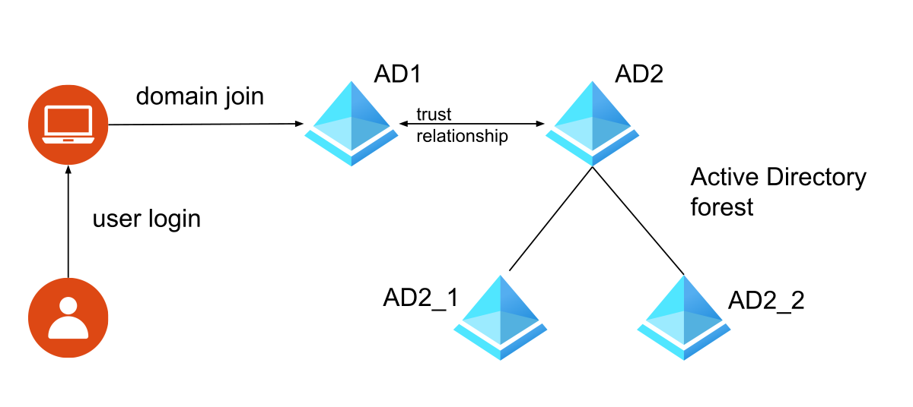

(introduction-to-active-directory-integration)=
# Introduction to Active Directory integration

Active Directory deployments can range from single-domain, one tree, with one or more servers, up to multiple domains and servers geographically dispersed spawning a structure that is referred to as a "forest". Furthermore, such a forest is not necessarily static, allowing its multiple delegated administrators to add and remove domains from it. Depending on the desired level of integration and the complexity of the domain or forest, joining an Ubuntu system to Active Directory requires different tooling, configuration, and planning.

Joining an Ubuntu system to an Active Directory domain (or a forest) means that the Ubuntu system will get an account in that domain, and be able to identify and authenticate users from that domain. In other words, a joined Ubuntu system should be able to:
- authenticate Active Directory users, including changing their passwords
- recognize the Active Directory users as valid users on the Ubuntu system, with linux-compatible user and group identifiers (more on that later)
- recognize group memberships

Depending on how the join was performed, and the software stack available on the Ubuntu system, the following is also possible:
- authenticate and recognize users from different domains that make up the forest
- apply certain group policy objects (not covered here)
- provide file and print services to users from the domain

To set up your Active Directory integrations, we suggest first familiarising yourself with the following key topics:

* {ref}`Choosing an integration method <choosing-an-integration-method>`
* {ref}`Security identifiers <security-identifiers-sids>`
* {ref}`Identity mapping backends <identity-mapping-idmap-backends>`
* {ref}`The rid idmap backend <the-rid-idmap-backend>`
* {ref}`The autorid idmap backend <the-autorid-idmap-backend>`

## References

- About Active Directory:
  - [Security Identifiers (SIDs)](https://learn.microsoft.com/en-us/windows-server/identity/ad-ds/manage/understand-security-identifiers)
  - [Active Directory Domain Services Overview](https://learn.microsoft.com/en-us/windows-server/identity/ad-ds/get-started/virtual-dc/active-directory-domain-services-overview)
- Samba Wiki pages:
  - [Choosing an identity mapping backend](https://wiki.samba.org/index.php/Setting_up_Samba_as_a_Domain_Member#Choosing_an_idmap_backend)
  - [rid identity mapping backend](https://wiki.samba.org/index.php/Idmap_config_rid)
  - [autorid identity mapping backend](https://wiki.samba.org/index.php/Idmap_config_autorid)
- Manual pages:
  - [idmap_tdb(8)](https://manpages.ubuntu.com/manpages/noble/man8/idmap_tdb.8.html)
  - [idmap_rid(8)](https://manpages.ubuntu.com/manpages/noble/man8/idmap_rid.8.html)
  - [idmap_autorid(8)](https://manpages.ubuntu.com/manpages/noble/man8/idmap_autorid.8.html)
  - [wbinfo(1)](https://manpages.ubuntu.com/manpages/noble/en/man1/wbinfo.1.html)
