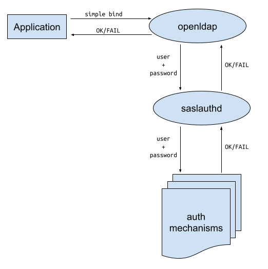

(ldap-saslauthd-authentication-intro)=
# How to configure OpenLDAP with pass-through authentication

## Background
Managing large groups of users is great use case for OpenLDAP, and then allowing external applications to authenticate its users against this database
allows the applications to offload user management to OpenLDAP. A sophisticated application can use a secure authentication method such as [Generic Security Services Application Programming Interface](https://www.openldap.org/doc/admin26/sasl.html#GSSAPI) (GSSAPI)
to attempt to bind to the OpenLDAP server and obtain the authentication but a less sophisticated application may only be able to performs a simple bind request to OpenLDAP. This simple bind request
supplies a username and password to OpenLDAP and then OpenLDAP checks the password against the hashed password it has stored internally and either accepts or rejects the bind.
Obviously there is a security concern sending plain passwords over a network so this technique must only be used over a TLS connection see {ref}`setting up Transport Layer Security (TLS) <ldap-and-tls>`

## What is pass-through authentication
A complication occurs when the passwords storage mechanism is outside of OpenLDAP. How can this simple bind process be used without storing the password in
the OpenLDAP database. One solution to this problem to use use the Simple Authentication and Security Layer (SASL) library to pass though this bind request to the mechanism where the password is
actually stored. The application that does this is the saslauthd daemon. This daemon can be configured to use various other authentication systems and will then
pass back the authentication status to OpenLDAP which in turn passes it back to the calling application.

A graphic showing this process is as follows:

## Saslauthd authentication providers
Authentication providers that saslauthd can use are:
- getpwent  -- use the getpwent() library function
- kerberos5 -- use Kerberos 5
- pam       -- use PAM
- rimap     -- use a remote IMAP server
- shadow    -- use the local shadow password file
- sasldb    -- use the local sasldb database file
- ldap      -- use LDAP (configuration is in /etc/saslauthd.conf)

Reference: https://www.openldap.org/doc/admin26/sasl.html
