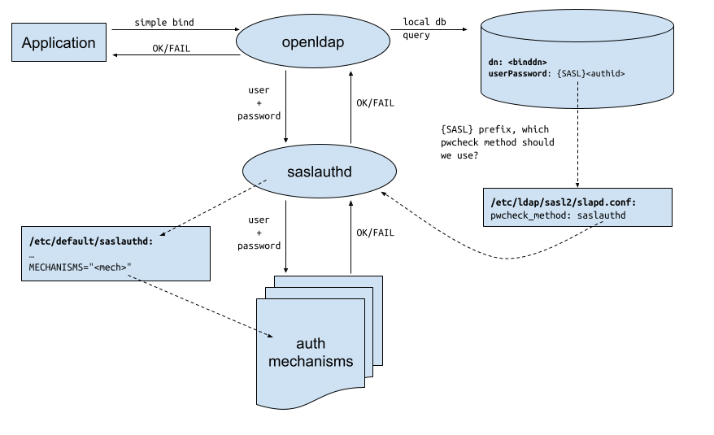

(ldap-saslauthd-kerberos)=
# How to configure OpenLDAP with passthrough SASL authentication using Kerberos

## Before you begin
It is assumed you are starting with a working OpenLDAP server, with a hostname of `ldap-server.example.com`. If not, follow this guide {ref}`Install and configure OpenLDAP<install-openldap>` to set it up. It is also assumed that the `EXAMPLE.COM` realm is set up, and the Kerberos client tools (krb5-user) are installed on the ldap server. You will need to create an ubuntu principal. See {ref}`How to install a Kerberos server <install-a-kerberos-server>`. You should also know how to create service principals. See {ref}`How to configure Kerberos service principals <configure-service-principals>`.
All the following configuration will be on `ldap-server.example.com`.
> **Note**:
> This process is not the same as using [Generic Security Services Application Programming Interface](https://www.openldap.org/doc/admin26/sasl.html#GSSAPI) (GSSAPI) to log into the LDAP server.
> Rather it is using [simple authentication](https://www.openldap.org/doc/admin26/security.html#%22simple%22%20method) with the OpenLDAP server so this should be over a [Transport Layer Security](https://datatracker.ietf.org/wg/tls/documents/) (TLS) connection.
> The test user we will be using is `ubuntu@EXAMPLE.COM` which must exist in the Kerberos database

## How the passthrough authentication will work
Here is a diagram showing how all the different pieces work together:



We will go over all these details next.

## Package installation
Install `saslauthd` on the OpenLDAP server (`ldap-server.example.com` in this document):

```bash
sudo apt install sasl2-bin
```

## Check the hostname
Get the hostname from the server
```bash
hostname -f
```
Which should give you the hostname of:
```text
ldap-server.example.com
```
Also check the hostname and domain using a reverse lookup with your IP. For example, if the IP address is `10.10.17.91`:
```bash
nslookup 10.10.17.91
```
The reply should look like this:
```text
91.17.10.10.in-addr.arpa        name = ldap-server.example.com.
```
If the result is the same as your host's canonical name them all is well. If the domain is missing, the [Fully Qualified Domain Name](https://en.wikipedia.org/wiki/Fully_qualified_domain_name) (FQDN) can be entered in the `/etc/hosts` file.
```bash
sudo vi /etc/hosts
```
Add the FQDN before the short hostname. Using the same IP as in the previous example, we would have:
```text
10.10.17.91 ldap-server.example.com ldap-server
```
## Create the saslauthd principal

The `saslauthd` daemon  needs a kerberos service principal in order to authenticate itself to the kerberos server. Such principals are created with a random password, and the resulting key is stored in `/etc/krb5.keytab`. For more information about kerberos service principals, please consult [How to configure Kerberos service principals](/how-to/kerberos/configure-service-principals/).

The simplest way to create this principal, and extract the key safely, is to run the `kadmin` tool remotely, instead of on the kerberos server. Since the key needs to be written to `/etc/krb5.keytab`, the tool needs to be run with root privileges. Additionally, since creating a new service principal, as well as extracting its key, are privileged operations, we need an `/admin` instance of a principal in order to be allowed these actions. In this example, we will use `ubuntu/admin`:

```bash
sudo kadmin -p ubuntu/admin
```
The result will be similar to this. Note the two commands we are issuing at the `kadmin:` prompt: `addprinc` and `ktadd`:
```text
Authenticating as principal ubuntu/admin with password.
Password for ubuntu/admin@EXAMPLE.COM
kadmin: addprinc -randkey host/ldap-server.example.com
No policy specified for host/ldap-server.example.com@EXAMPLE.COM; defaulting to no policy
Principal "host/ldap-server.example.com@EXAMPLE.COM" created.
kadmin: ktadd host/ldap-server.example.com
Entry for principal host/ldap-server.example.com with kvno 2, encryption type aes256-cts-hmac-sha1-96 added to keytab FILE:/etc/krb5.keytab.
Entry for principal host/ldap-server.example.com with kvno 2, encryption type aes128-cts-hmac-sha1-96 added to keytab FILE:/etc/krb5.keytab.
```
To check that the service principal was added to `/etc/krb5.keytab`, run this command:
```bash
sudo klist -k
```
You should see the following:
```text
Keytab name: FILE:/etc/krb5.keytab
KVNO Principal
---- --------------------------------------------------------------------------
   2 host/ldap-server.example.com@EXAMPLE.COM
   2 host/ldap-server.example.com@EXAMPLE.COM
```
## Configure saslauthd
We now need to configure `saslauthd` such that it uses Kerberos authentication. This is an option that is selected at startup time, via command-line options. The configuration file for such options is `/etc/default/saslauthd`. Only one change is needed in this file: update `MECHANISMS` to `kerberos5`:

```bash
sudo vi /etc/default/saslauthd
```
Make the following change:
```text
...
# Which authentication mechanisms should saslauthd use? (default: pam)
#
# Available options in this Debian package:
# getpwent  -- use the getpwent() library function
# kerberos5 -- use Kerberos 5
# pam       -- use PAM
# rimap     -- use a remote IMAP server
# shadow    -- use the local shadow password file
# sasldb    -- use the local sasldb database file
# ldap      -- use LDAP (configuration is in /etc/saslauthd.conf)
#
# Only one option may be used at a time. See the saslauthd man page
# for more information.
#
# Example: MECHANISMS="pam"
MECHANISMS="kerberos5"
...
```
> **Note**:
> For Ubuntu version 22.04 and earlier "START=yes" must also be added to the default config file to have sasauthd restart after rebooting.

Save and exit the editor.

## Enable and start saslauthd
Continue by enabling and starting the saslauthd service.

```bash
sudo systemctl enable --now saslauthd
```
## Test saslauthd configuration
The `saslauthd` service can be tested with with the `testsaslauthd` command. For example, with the correct Kerberos password for the `ubuntu` principal:

```bash
testsaslauthd -u ubuntu -p ubuntusecret
0: OK "Success."
```
And with the wrong Kerberos password:
```bash
testsaslauthd -u ubuntu -p ubuntusecretwrong
0: NO "authentication failed"
```

## Configure OpenLDAP
In order for OpenLDAP to perform passthrough authentication using `saslauthd`, we need to create the configuration file `/etc/ldap/sasl2/slapd.conf` with the following content:
```text
pwcheck_method: saslauthd
```
This will direct OpenLDAP to use `saslauthd` as the password checking mechanism when performing passthrough authentication on behalf of a user. After making this change, restart the OpenLDAP service:
```
sudo systemctl restart slapd.service
```
## Change the `userPassword` attribute
What triggers OpenLDAP to perform a passthrough authentication when processing a simple bind authentication request, is the special content of the `userPassword` attribute. Normally, that attribute contains some form of password hash, which is used to authenticate the request. If, however, what it contains is in the format of `{SASL}username@realm`, then OpenLDAP will delegate the authentication to the SASL library, whose configuration is in that file we just created above.

For example, let's examine the directory entry below:
```text
dn: uid=ubuntu,dc=example,dc=com
uid: ubuntu
objectClass: account
objectClass: simpleSecurityObject
userPassword: {SSHA}S+WlmGneLDFeCwErKnY4mJngnVJMZAM5
```
If a simple bind is performed using a binddn of `uid=ubuntu,dc=example,dc=com`, the password will be checked against the hashed `userPassword` value as normal. That is, no passthrough authentication will be done at all.

However, if the `userPassword` attribute is in this format:
```text
userPassword: {SASL}ubuntu@EXAMPLE.COM
```
That will trigger the passthrough authentication, because the `userPassword` attribute starts with the special prefix `{SASL}`. This will direct OpenLDAP to use `saslauthd` for the authentication, and use the name provided in the `userPassword` attribute.

> **IMPORTANT**
>
> Note how the username present in the `userPassword` attribute is independent of the binddn used in the simple bind! If the `userPassword` attribute contained, say, `{SASL}anotheruser@EXAMPLE.COM`, OpenLDAP would ask `saslauthd` to authenticate `anotheruser@EXAMPLE.COM`, and not the user from the binddn! Therefore, it's important to use OpenLDAP ACLs to prevent users from changing the `userPassword` attribute when using passthrough authentication!

To continue with this how-to, let's create the `uid=ubuntu` entry in the directory, which will use passthrough authentication:
```text
ldapadd -x -D cn=admin,dc=example,dc=com -W <<LDIF
dn: uid=ubuntu,dc=example,dc=com
uid: ubuntu
objectClass: account
objectClass: simpleSecurityObject
userPassword: {SASL}ubuntu@EXAMPLE.COM
LDIF
```

> **NOTE**
>
> Note how we don't need to add the posix attributes like user id, home directory, group, etc. All we really need is a directory entry that contains a `userPassword` attribute.

## Test the authentication
To test that the simple bind is working, and using the kerberos password for the `ubuntu` user, let's use `ldapwhoami`:
```text
ldapwhoami -D uid=ubuntu,dc=example,dc=com -W -x
Enter LDAP Password:
```
A successful bind will look like
```text
dn:uid=ubuntu,dc=example,dc=com
```
A failed bind will look like
```text
ldap_bind: Invalid credentials (49)
```
These LDAP bind DNs can now be used with external applications that only support "simple" username and password authentication, and they will be authenticated against Kerberos behind the scenes.

## Troubleshooting
Saslauthd can be run in debug mode for more verbose messages to aid in troubleshooting
```text
sudo systemctl stop saslauthd
sudo /usr/sbin/saslauthd -a kerberos5 -d -m /var/run/saslauthd -n 1
```
Also the `/var/log/auth.log` file can be checked for saslauthd log entries

## Advanced options
Saslauthd can be configured in the `/etc/saslauthd.conf` file. The settings depend on the authorization mechanism configured in `/etc/default/saslauthd`,
which in this case is `kerberos5`.

Some options are:
`krb5_keytab` which can override the default keytab file location of `/etc/krb5.keytab` and
`krb5_verify_principal` which changes the kerberos principle doing the verifying from `host`.

Example
```bash
sudo vi /etc/saslauthd.conf
```
Change the keytab and principal
```text
krb5_keytab: /etc/saslauthd.keytab
krb5_verify_principal: saslauthd
```


## References

  - [OpenLDAP Passthrough Authentication](https://www.openldap.org/doc/admin26/security.html#Pass-Through%20authentication)
  - [Cyrus SASL Password Verification](https://www.cyrusimap.org/sasl/sasl/components.html#password-verification-services)
  - [Cyrus SASL Slapd Configuration File](https://www.cyrusimap.org/sasl/sasl/faqs/openldap-sasl-gssapi.html)
  - [Kerberos Client Hostname Requirements](https://web.mit.edu/kerberos/krb5-1.12/doc/admin/princ_dns.html)
