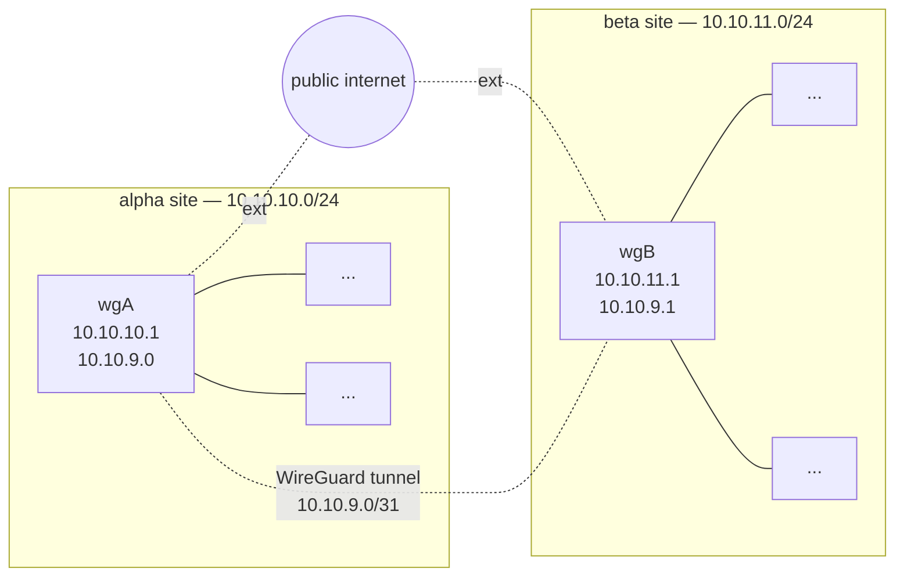

(wireguard-vpn-site-to-site)=
# WireGuard VPN site-to-site

Another usual VPN configuration where one could deploy WireGuard is to connect two distinct networks over the internet. Here is a simplified diagram:

The following code-block will be rendered as a Mermaid diagram:


         
The goal here is to seamlessly integrate network **alpha** with network **beta**, so that systems on the alpha site can transparently access systems on the beta site, and vice-versa.

Such a setup has a few particular details:

- Both peers are likely to be always up and running.
- We can't assume one side will always be the initiator, like the laptop in a coffee shop scenario.
- Because of the above, both peers should have a static endpoint, like a fixed IP address, or valid domain name.
- Since we are not assigning VPN IPs to all systems on each side, the VPN network here will be very small (a `/31`, which allows for two IPs) and only used for routing. The only systems with an IP in the VPN network are the gateways themselves.
- There will be no NAT applied to traffic going over the WireGuard network. Therefore, the networks of both sites **must** be different and not overlap.

This is what an MTR (My Traceroute) report from a system in the beta network to an alpha system will look like:

```bash
ubuntu@b1:~$ mtr -n -r 10.10.10.230
Start: 2022-09-02T18:56:51+0000
HOST: b1                Loss%   Snt   Last   Avg  Best  Wrst StDev
  1.|-- 10.10.11.1       0.0%    10    0.1   0.1   0.1   0.2   0.0
  2.|-- 10.10.9.0        0.0%    10  299.6 299.3 298.3 300.0   0.6
  3.|-- 10.10.10.230     0.0%    10  299.1 299.1 298.0 300.2   0.6
```

```{note}
Technically, a `/31` Classless Inter-Domain Routing (CIDR) network has no usable IP addresses, since the first one is the network address, and the second (and last) one is the broadcast address. [RFC 3021](https://www.ietf.org/rfc/rfc3021.txt) allows for it, but if you encounter routing or other networking issues, switch to a `/30` CIDR and its two valid host IPs.
```

## Configure WireGuard

On the system that is the gateway for each site (that has internet connectivity), we start by installing WireGuard and generating the keys. For the **alpha** site:

```bash
$ sudo apt install wireguard
$ wg genkey | sudo tee /etc/wireguard/wgA.key
$ sudo cat /etc/wireguard/wgA.key | wg pubkey | sudo tee /etc/wireguard/wgA.pub
```

And the configuration on alpha will be:

```
[Interface]
PostUp = wg set %i private-key /etc/wireguard/%i.key
Address = 10.10.9.0/31
ListenPort = 51000

[Peer]
# beta site
PublicKey = <contents of /etc/wireguard/wgB.pub>
AllowedIPs = 10.10.11.0/24,10.10.9.0/31
Endpoint = <beta-gw-ip>:51000
```

On the gateway for the **beta** site we take similar steps:

```bash
$ sudo apt install wireguard
$ wg genkey | sudo tee /etc/wireguard/wgB.key
$ sudo cat /etc/wireguard/wgB.key | wg pubkey | sudo tee /etc/wireguard/wgB.pub
```

And create the corresponding configuration file for beta:

```
[Interface]
Address = 10.10.9.1/31
PostUp = wg set %i private-key /etc/wireguard/%i.key
ListenPort = 51000

[Peer]
# alpha site
PublicKey = <contents of /etc/wireguard/wgA.pub>
AllowedIPs = 10.10.10.0/24,10.10.9.0/31
Endpoint = <alpha-gw-ip>:51000
```

```{important}
WireGuard is being set up on the gateways for these two networks. As such, there are no changes needed on individual hosts of each network, but keep in mind that the WireGuard tunneling and encryption is only happening between the *alpha* and *beta* gateways, and **NOT** between the hosts of each network.
```

## Bring the interfaces up

Since this VPN is permanent between static sites, it's best to use the systemd unit file for `wg-quick` to bring the interfaces up and control them in general. In particular, we want them to be brought up automatically on reboot events.

On **alpha**:

```bash
$ sudo systemctl enable --now wg-quick@wgA
```

And similarly on **beta**:

```bash
$ sudo systemctl enable --now wg-quick@wgB
```

This both enables the interface on reboot, and starts it right away.

## Firewall and routing

Both gateways probably already have some routing and firewall rules. These might need changes depending on how they are set up.

The individual hosts on each network won't need any changes regarding the remote alpha or beta networks, because they will just send that traffic to the default gateway (as any other non-local traffic), which knows how to route it because of the routes that `wg-quick` added.

In the configuration we did so far, there have been no restrictions in place, so traffic between both sites flows without impediments.

In general, what needs to be done or checked is:

- Make sure both gateways can contact each other on the specified endpoint addresses and UDP port. In the case of this example, that is port `51000`. For extra security, create a firewall rule that only allows each peer to contact this port, instead of the Internet at large.
- Do NOT masquerade or NAT the traffic coming from the internal network and going out via the WireGuard interface towards the other site. This is purely routed traffic.
- There shouldn't be any routing changes needed on the gateways, since `wg-quick` takes care of adding the route for the remote site, but do check the routing table to see if it makes sense (`ip route` and `ip route | grep wg` are a good start).
- You may have to create new firewall rules if you need to restrict traffic between the alpha and beta networks.

  For example, if you want to prevent SSH between the sites, you could add a firewall rule like this one to **alpha**:

  `$ sudo iptables -A FORWARD -i wgA -p tcp --dport 22 -j REJECT`

  And similarly on **beta**:

  `$ sudo iptables -A FORWARD -i wgB -p tcp --dport 22 -j REJECT`

  You can add these as `PostUp` actions in the WireGuard interface config. Just don't forget to remove them in the corresponding `PreDown` hook, or you will end up with multiple rules.
